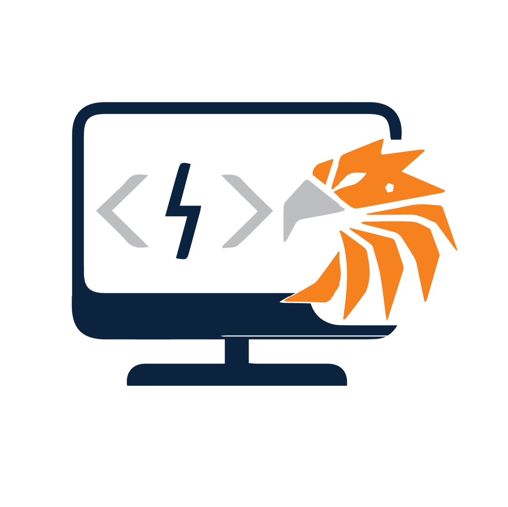

# Welcome To The Dev Hawks Website

## Introduction

Welcome to the official GitHub repository of Dev Hawks, the premier club for computer science, cybersecurity, and information systems enthusiasts at [University of Tennessee at Martin]. Our club is dedicated to fostering a community of passionate learners and professionals in technology fields.

Visit our website: [Dev Hawks Website](https://connorgladish.github.io/DevHawksWebsite/)

## Features

- **About Us:** Learn about who we are, our mission, and our goals.
- **Events:** Stay updated on our latest events, workshops, and guest lectures.
- **Projects:** Explore projects developed by our members.
- **Resources:** Access useful resources related to computer science, cybersecurity, and information systems.
- **Contact:** Reach out to us for inquiries, collaborations, or feedback.

## Technologies Used

- **Frontend:** HTML, CSS, JavaScript
- **Backend:** Node.js, Express.js
- **Database:** MongoDB
- **Hosting:** GitHub Pages

## How to Contribute

We welcome contributions from all our members. If you find any issues or have suggestions for improvements, feel free to:

1. Fork the repository
2. Create your feature branch (`git checkout -b feature/YourFeature`)
3. Commit your changes (`git commit -am 'Add some feature'`)
4. Push to the branch (`git push origin feature/YourFeature`)
5. Create a new Pull Request

## Contact Us

- Email: [devhawksutm@gmail.com.com](mailto:devhawksutm@gmail.com)

## License

This project is licensed under the MIT License - see the [LICENSE](LICENSE) file for details.
